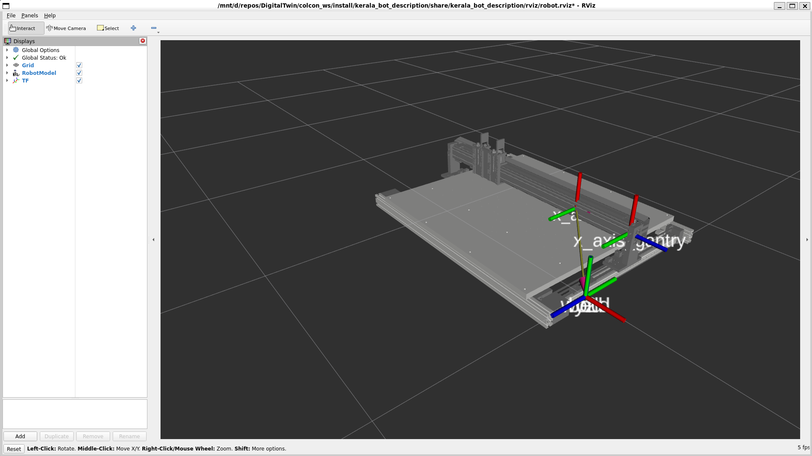

# DigitalTwin

<p align="center">
  
</p>
This repo contains the ROS2 Humble workspace that holds the digital twin of the Urumi's latest design, the urdf was converted in segments and the physics / motion relation between each of these segments was defined manually. A direct URDF export wont work on the current design as the design tree structure needs to be modified to do so (not recommended)
The current setup has 2 implementations one is digital twin of the live machine telemetry, & a stepper+belt simulator that predicts whether a trajectory is executable before you run it.  This uses RViz- and open source simulator as a visualization tool, ROS is not required per say as it handle only the inter preocess communications and can be done directly via network ports which are much efficient. But it does provide an intuitive off-the-shelf tools and message types that ease the process of working with RViz. As such I have used ROS topics and messaging mechanisms to implement the same.
<br>
</br>

> During tests at the Kerala Lab we spotted significant error accumulation when both the axis are moved parallel especially at higher speeds i.e. motion plans at speeds < 100 mm/s. This is mostly likely due to belt slip and can be solved by proper velocity profilining. This might not be a requirement right now as the operational speeds of the ultrasonic limit our max operational speeds. But the microsegment generator needs to take into consideration the physical model of the system to plan for trajectories  and check for validity before execution as there is no velocity profile check at the controller end.

## Power design reports

Me and Ashish ran a few power design simulations on the current power stage design to indentify any potential issues we did this through TI WEBENCH, I have added those reports under the [`reports/`](reports/) folder :

| Report | What it shows |
|---|---|
| `WBDesign7_Steady State` | Nominal operating waveforms, efficiency, and losses |
| `WBDesign7_Startup` | Output voltage ramp at power-on |
| `WBDesign7_Load Transient` | Response to a step change in load current |
| `WBDesign7_Input Transient` | Response to a step change in input voltage |

## Install ROS2 Humble

This project targets **ROS2 Humble**. Follow the official guide for your platform:
[ROS2 Humble Installation](https://docs.ros.org/en/humble/Installation.html)

## Build

```bash
cd colcon_ws
colcon build
source install/setup.bash          # run this in every new terminal
```

## 1. View the model with manual sliders

Brings up RViz + a slider per joint to jog the axes by hand.

```bash
ros2 launch kerala_bot_description display.launch.py
```

## 2. Drive it from live machine telemetry

Follows the machine's real position instead of sliders. Set your workspace limits and input
topic in [config/machine_state.yaml](colcon_ws/src/kerala_bot_sim/config/machine_state.yaml),
then:

```bash
ros2 launch kerala_bot_sim bringup.launch.py
```

Test it without hardware: publish a fake position and watch the twin move:

```bash
ros2 topic pub -r 10 /machine/position geometry_msgs/msg/Point "{x: 0.6, y: 0.47, z: 0.0}"
```

## 3. Simulate a trajectory (lost-step prediction)

Predicts the actual path for a commanded trajectory and flags it FEASIBLE / INFEASIBLE.
Pure Python, runs without ROS:

```bash
cd colcon_ws/src/kerala_bot_sim
python -m kerala_bot_sim.run_demo            # writes output/overlay.png + output/sim_log.csv
python -m kerala_bot_sim.run_demo --animate  # progressive commanded-vs-actual drawing
```

Replay a simulation log in RViz:

```bash
ros2 launch kerala_bot_sim playback.launch.py \
    log:=$(pwd)/output/sim_log.csv
```

## Folder structure

```
DigitalTwin/
├── colcon_ws/src/
│   ├── kerala_bot_description/     # the robot: URDF/xacro, meshes, RViz config
│   │   ├── urdf/robot.xacro        #   links + joints (bed→y2→x_axis→x_axis_gantry)
│   │   ├── meshes/                 #   per-link STLs
│   │   ├── rviz/robot.rviz
│   │   └── launch/display.launch.py
│   └── kerala_bot_sim/             # simulator + live-state + RViz playback
│       ├── kerala_bot_sim/         #   python: model, simulate, state_listener, ...
│       ├── config/                 #   machine_state.yaml, axis_map.yaml
│       ├── launch/                 #   bringup.launch.py, playback.launch.py
│       └── output/                 #   sim logs + overlay plots (generated)
├── docs/                           # characterization_plan.md, params_template.yaml
├── reports/                        # TI WEBENCH power-supply design reports (PDF)
├── urdf/                           # raw per-subassembly Onshape URDF exports (source)
├── assets/                         # images / diagrams for docs
└── kerala_urdf.urdf, logs.txt      # original broken flat export (kept for reference)
```


> Only one of the three drives `/joint_states` at a time, don't run sliders, live, and
> playback together. More detail in
> [kerala_bot_sim/README.md](colcon_ws/src/kerala_bot_sim/README.md).


